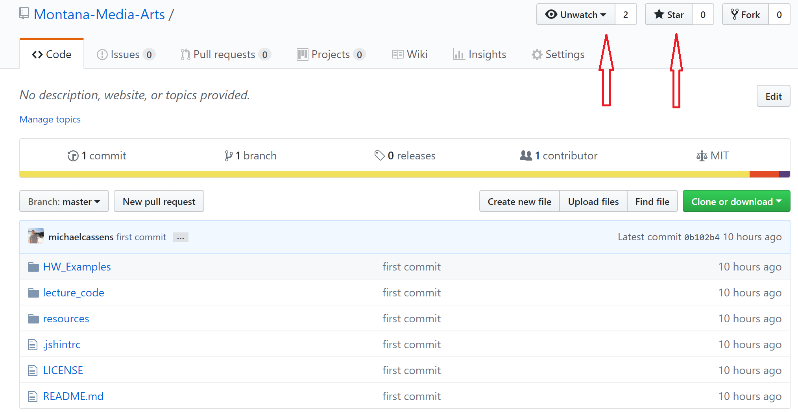

<!-- Consider moving to week 2. Instead, replace with Moodle forum info. -->

  <button class="tablinks active" onclick="openTab(event, 'Overview')">Overview</button>
  <button class="tablinks" onclick="openTab(event, 'Watch')">Watch and Star</button>
 

This class utilizes [GitHub.com](https://github.com). Not only is this service where you will host your git repo's and live websites, but this content site lives in GitHub and there is a "resources" repo for this site that contains.

- code examples for this course
- and an issues forum where you can ask each other for help.

## "Watch" and Star The Course Resource Repository

By "watching" the course repository you will be get notifications about new issues as well as when new resources become available.

To watch the course repo;

- Navigate to [Samples website](https://github.com/Montana-Media-Arts/220_CreativeCoding2-Spring2024-Samples/issues). This issues forum for this site is also linked to from the "Issues-Forum" tab above in the navbar.
- In the upper right-hand corner, you should select both "watching" and "star".
    - This will allow GitHub to e-mail you about notifications and issues in the course repo.
        - When you have problems, post them here.
        - If you get an email about a new issue, try to help the person out.
        - Your participation grade will be based on how active you were on the GitHub issues forum, as well as comments to your classmates to their weekly homework assignments.

