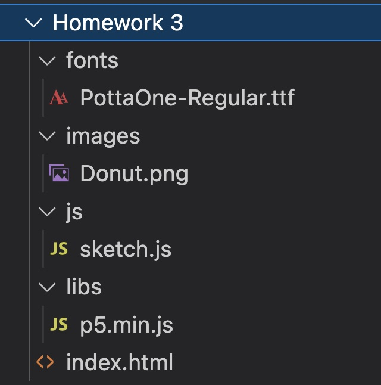

# Homework

In this homework, you are going to continue working on your favorite food project, add images, and incorporate movement using a timer.  Finally, add a new font for the title and your name.

<a href="https://github.com/Montana-Media-Arts/220_CreativeCoding2-Spring2024-Samples/tree/main/Homework%203" target="_blank">Homework 4 Example</a>

It should have the following properties:
1.	Make sure the directory structure is organized.
    * For example, it might look something like this:
    
2.	Add at least 3 images.  You can make at least one Generative AI image.
3.	Make at least one image move around the screen.
4.  Use a timer function to move an image.
5.	Change the font of the title and of your name.
6.  Write a reflection on the Generative AI image you created and its source.  Why did you use it that particular model?  Was it what you expected?
7.  Submit everything to GitHub and submit your link to Moodle.
